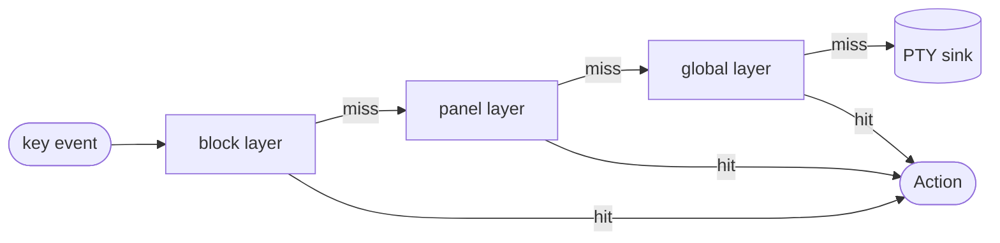

# keymap-rs

A Cargo workspace of small Rust crates that turn key presses into your own action type and nothing more.

**Who this is for.** Authors of terminal UIs, modal editors, leader-key apps, PTY hosts, and terminal multiplexers who want their keymap to be configurable, conflict-aware, discoverable, and (with `keymap-term`) able to recover keypresses from raw terminal bytes.

**Most people should start with [`keymap-suite`](#start-here-keymap-suite)** — the one-import facade that bundles loading, layered resolution, multi-key sequences, and help-screen discovery for the nine-out-of-ten TUI case. Reach for the individual foundation crates only when you need to drop a level lower (your own backend, raw-byte decoding, empirical reachability).

- [Start here: `keymap-suite`](#start-here-keymap-suite)
- [What it is, and the one rule](#what-it-is-and-the-one-rule)
- [The crate map](#the-crate-map)
- [Lookup: a miss is "pass through"](#lookup-a-miss-is-pass-through)
- [Layered resolution: context without a context type](#layered-resolution-context-without-a-context-type)
- [Multi-key sequences](#multi-key-sequences)
- [Config: TOML in, warnings out](#config-toml-in-warnings-out)
- [The measurement-first capability layer](#the-measurement-first-capability-layer)
- [Build, test, and add it to your project](#build-test-and-add-it-to-your-project)

## Start here: `keymap-suite`

If you are building a TUI and want keybindings that load from a TOML file, resolve per context, support `ctrl+x ctrl+s`-style sequences, and feed a help screen — add one crate and import its prelude:

```toml
[dependencies]
keymap-suite = "0.1"
# Reading events through crossterm? Turn on the adapter:
# keymap-suite = { version = "0.1", features = ["crossterm"] }
```

```rust
use keymap_suite::prelude::*;

#[derive(Clone, Debug, PartialEq)]
enum Action { Quit, Save, SplitPane }

fn resolve(name: &str) -> Option<Action> {
    match name {
        "quit" => Some(Action::Quit),
        "save" => Some(Action::Save),
        "split_pane" => Some(Action::SplitPane),
        _ => None,
    }
}

// Lenient by default (warnings are collected, not fatal). For a CI / production
// startup gate, add `.deny_warnings()?` here to fail on any warning.
let loaded = keymap_suite::from_toml_str(SETTINGS, resolve)?;

// 1. Resolve a key. The active layer chain is *yours* — assembled from your
//    own UI state (which panel is focused, is a popup open) per event. The
//    minimal case is one layer, `[loaded.global()]`, which costs you nothing.
let chain = [loaded.global()];
if let Some(action) = resolve_layered(chain.iter().copied(), &key) {
    // run `action`
}

// 2. Multi-key sequences: you own the pending buffer; the suite does the trie.
let mut pending = loaded.pending_sequence();
match pending.feed(&loaded.sequences, key) {
    Step::Fired(action)         => { /* run it */ }
    Step::Pending               => { /* (re)start your idle timer */ }
    Step::PassThrough(literals) => { /* forward these keys */ }
}

// 3. Help screen / which-key: ask the reverse question.
let save_keys = keys_for_action(loaded.global(), &Action::Save); // Vec<&KeyInput>
```

**What the suite gives you, and what stays yours.** The suite owns the *mechanical* glue: parsing TOML into named layers, the prefix-free sequence trie and its pending buffer, reverse lookup for help. You keep the *domain* state, because only your app knows it: **which layers are active right now** (your mode / focus / popup) and **the inter-key timer** that decides a half-typed sequence was abandoned. This split is deliberate — see [the one rule](#what-it-is-and-the-one-rule). For the full walkthrough see the [`keymap-suite` README](crates/keymap-suite/README.md) and `cargo run -p keymap-suite --example load_and_resolve`.

## What it is, and the one rule

The unifying principle is one sentence: the library is state-free, and the caller owns all state.

> [!NOTE]
> No library crate holds a clock, a mutable mode or context, or a sequence buffer. Those are yours. The library answers "what does this key mean right now, given the table you handed me" and stops there.

That choice has a clear trade. You get a pure, testable core that never names your domain enum and never tracks "what mode am I in", so the same lookup is trivially unit-testable without a terminal. In exchange, you hold the mode, the pending-key buffer, and the inter-key timeout yourself; the library will not do it for you.

The action type `A` is always caller-defined. `Keymap<A>` places no bound on `A` at all, so your action enum can be whatever your app needs, and the library never sees inside it.

The design grew from four recurring pains in terminal UI work: configurable bindings with conflicts you can actually see, key reception that varies by terminal and environment, the constant passthrough-versus-consume decision, and binding discovery for which-key style menus. Each crate below addresses one of them.

## The crate map

> Most readers can skip this — it is for picking a *single foundation crate* when the [`keymap-suite`](#start-here-keymap-suite) facade is more than you need. If in doubt, use the suite.

The foundation crates all build on `keymap-core`, and the `crossterm` feature on the core is optional. The rows below are ordered by how often a typical caller reaches for them.

| When you want to… | Crate | Role | Key types and functions |
| --- | --- | --- | --- |
| **Everything below, in one import** (the common case) | [`keymap-suite`](crates/keymap-suite/README.md) | The facade: TOML load + layered resolve + sequences + discovery, with a `prelude`. Optional `crossterm` feature. | `from_toml_str`, `from_toml_path`, `Loaded`, `keys_for_action`, `prelude`, `LoadError` |
| **Bind keys to your action enum in a TUI** | `keymap-core` | Neutral key vocabulary and a generic `Keymap<A>` lookup table. State-free; a miss is *pass through*. Optional `crossterm` feature for `TryFrom<KeyEvent>`. | `Key`, `Modifiers`, `KeyInput`, `Keymap<A>`, `resolve_layered`, `resolve_passthrough`, `legacy_lints` |
| **Load those bindings from a TOML file** (with conflicts as warnings, not errors) | `keymap-config` | TOML `[keys]` / `[layers.<name>]` / `[[sequences]]` → named-layer keymap + sequence keymap; resolves action names via a caller-supplied closure. Round-trippable. | `from_str`, `BuildOutput<A>`, `Warning`, `to_toml`, `to_toml_layered` |
| **Bind multi-key sequences** (`ctrl+x ctrl+s`, leader trees, vim-style) | `keymap-seq` | Prefix-free multi-chord trie; the pending buffer and any inter-key timeout live caller-side. | `SequenceKeymap<A>`, `Match`, `Continuation`, `SeqBindError` |
| **Recover `KeyInput` from raw terminal bytes** (PTY host, terminal multiplexer) | `keymap-term` | Measurement-first byte decoder built from committed `captures/*.toml` fixtures rather than assumptions — the package's strongest differentiator. | `decode`, `Decoded`, `DecodeMode`, `reachability`, `Reachability` |

> [!NOTE]
> `keymap-probe` and `keymap-tui` are dev tools, not library API. They read keystrokes interactively and must run in a real terminal, so they cannot run headless or in CI. Nothing depends on them.

## Lookup: a miss is "pass through"

The whole lookup contract is the return type: `Keymap::get(&self, input: &KeyInput) -> Option<&A>`, where `None` is not an error but the "pass it through" signal.

```rust
use keymap_core::{Key, KeyInput, Keymap, Modifiers};

#[derive(Clone, Debug, PartialEq)]
enum Action {
    Quit,
    Save,
}

let mut keymap = Keymap::new();
keymap.bind(KeyInput::new(Key::Char('q'), Modifiers::CTRL), Action::Quit);
keymap.bind(KeyInput::new(Key::Char('s'), Modifiers::CTRL), Action::Save);

let input = KeyInput::new(Key::Char('q'), Modifiers::CTRL);
match keymap.get(&input) {
    Some(action) => println!("consume {action:?}"),
    None => println!("pass through"),
}
```

Modifiers are part of the key, not a separate flag you check later: `KeyInput::new(Key::Char('s'), Modifiers::CTRL)` is a distinct binding from `Char('s')` with no modifiers. Combine modifiers with the bitwise-or, for example `Modifiers::CTRL | Modifiers::SHIFT`.

The rest of the table surface is one line each: `bind` returns the previous action for that chord, `unbind` removes one, `contains` tests membership, `len` and `is_empty` size the table, and `iter` walks every `(&KeyInput, &A)` pair for discovery.

One normalization rule matters for matching. `KeyInput::normalized` folds a bare `shift+a` to `a` (where Shift is redundant with the resolved glyph) but keeps Shift in a multi-modifier chord like `ctrl+shift+s`; plain `KeyInput::new` applies no normalization, so pass it values you already know are normalized. The runnable version of this section is `crates/keymap-core/examples/basic_lookup.rs`.

## Layered resolution: context without a context type

The same `ctrl+s` can mean Save in an editor and Split in a panel, and the library delivers that without ever learning what a "context" is.



The call is `resolve_layered(layers, input) -> Option<&A>`: the caller picks which `Keymap` layers are active and in what order, the earliest layer to bind the chord wins, and misses fall outward through the chain. This is a lexical scope chain, the same shape as variable resolution in a nested scope. The context *tree* lives entirely on your side and is flattened into a flat ordered list per event, which is what keeps the library stateless.

```rust
use keymap_core::{Key, KeyInput, Keymap, Modifiers, resolve_layered};

#[derive(Clone, Debug, PartialEq)]
enum Action {
    Save,
    SplitPanel,
}

fn ctrl(c: char) -> KeyInput {
    KeyInput::new(Key::Char(c), Modifiers::CTRL)
}

let mut base = Keymap::new();
base.bind(ctrl('s'), Action::Save);

let mut panel = Keymap::new();
panel.bind(ctrl('s'), Action::SplitPanel);

// In editor context only `base` is active; in panel context `panel` wins first.
let editor = vec![&base];
let panel_ctx = vec![&panel, &base];

assert_eq!(resolve_layered(editor.iter().copied(), &ctrl('s')), Some(&Action::Save));
assert_eq!(resolve_layered(panel_ctx.iter().copied(), &ctrl('s')), Some(&Action::SplitPanel));
```

For a terminal multiplexer there is a raw-byte-carrying sibling, `resolve_passthrough(layers, input, raw) -> Resolution`. The enum is exhaustive: `Resolution::Action(&A)` on a hit, `Resolution::Passthrough(RawInput)` on a miss carrying the original bytes for verbatim forwarding, and `Resolution::Consume`. The resolver never returns `Consume` itself, that disposition is yours to assign when you are grabbing keys; `RawInput` borrows the read buffer, and the PTY is a sink past the end of the chain, never a layer inside it. The runnable version is `crates/keymap-core/examples/modal_keymap.rs`.

## Multi-key sequences

`keymap-seq` answers "exact, prefix, or miss" for a sequence of chords with a pure trie lookup; the pending buffer and any timeout stay with you.

> [!WARNING]
> The sequence table is prefix-free: a chord cannot be both a terminal action and the prefix of a longer sequence. `bind` rejects the collision at build time with `SeqBindError::PrefixShadow`, which is exactly what keeps `lookup` total — there is no fourth outcome to handle.

The lookup signature is `SequenceKeymap::lookup(&[KeyInput]) -> Match<'_, A>`, and `Match { Exact(&A), Prefix, NoMatch }` is exhaustive. You push each key onto a pending buffer, then clear it on `Exact` or `NoMatch` and keep it on `Prefix`.

```rust
use keymap_core::{Key, KeyInput, Modifiers};
use keymap_seq::{Match, SequenceKeymap};

#[derive(Debug, Clone, Copy, PartialEq, Eq)]
enum Action {
    Save,
}

fn ctrl(c: char) -> KeyInput {
    KeyInput::new(Key::Char(c), Modifiers::CTRL)
}

let mut map = SequenceKeymap::new();
map.bind([ctrl('x'), ctrl('s')], Action::Save).unwrap();

let mut pending: Vec<KeyInput> = Vec::new();
for key in [ctrl('x'), ctrl('s')] {
    pending.push(key);
    match map.lookup(&pending) {
        Match::Exact(action) => {
            println!("fire {action:?}");
            pending.clear();
        }
        Match::Prefix => println!("prefix, waiting"),
        Match::NoMatch => pending.clear(),
    }
}
```

A `jj`-style time window is caller-side policy, because the library owns no clock: you measure the inter-key gap and decide when to flush a dangling prefix. The runnable version, including the timed `jj` demo, is `crates/keymap-seq/examples/leader_sequence.rs`.

`bind(seq, action) -> Result<Option<A>, SeqBindError>` returns the displaced action on a clean rebind, or one of `SeqBindError::{ PrefixShadow { sequence, conflict }, Empty }`. For which-key style menus, `continuations(&[KeyInput])` yields each next `(KeyInput, Continuation)` where `Continuation { Action(&A), Prefix }`, and `bindings()` yields every leaf as `(Vec<KeyInput>, &A)`.

## Config: TOML in, warnings out

`from_str(toml, resolve) -> Result<BuildOutput<A>, BuildError>` takes a `resolve: FnMut(&str) -> Option<A>` closure and returns `BuildOutput { layers, sequences, warnings }`, where `layers: BTreeMap<String, Keymap<A>>` holds every layer by name. The bare `[keys]` table is the `"global"` layer (`GLOBAL_LAYER`), always present; `out.global()` is the convenience accessor for it. Each `[layers.<name>]` table is a caller-named layer holding chord→action entries directly.

The error-versus-warning split is the design point: malformed TOML or an unparseable key string is a fatal `BuildError` because there is no usable map to return, while a chord bound twice or an unknown action name is a non-fatal `Warning` so the rest of the bindings still work.

```rust
use keymap_config::Warning;

#[derive(Clone, Debug, PartialEq)]
enum Action {
    Quit,
    Save,
    SplitPane,
}

let toml = r#"
[keys]
"ctrl+q" = "quit"
"ctrl+s" = "save"
"control+s" = "split_pane"   # same chord as ctrl+s -> conflict
"ctrl+z" = "undo"            # no such action -> unknown
"#;

let out = keymap_config::from_str(toml, |name| match name {
    "quit" => Some(Action::Quit),
    "save" => Some(Action::Save),
    "split_pane" => Some(Action::SplitPane),
    _ => None,
})
.expect("valid TOML and key strings");

for warning in &out.warnings {
    match warning {
        Warning::Conflict { chord, contenders, winner } => {
            println!("conflict on {chord}: {contenders:?} — kept {winner:?}");
        }
        Warning::UnknownAction { key, action } => {
            println!("{key}: unknown action {action:?}");
        }
        _ => println!("(other warning)"),
    }
}
```

Five warnings exist today: `Conflict`, `UnknownAction`, `PrefixShadow`, `EmptySequence`, and `SequenceShadow`. `Warning` is `#[non_exhaustive]`, so your `match` needs a `_` arm.

The TOML shape is small. The `[keys]` table maps `"key" = "action"` for single chords; a `[layers.<name>]` table does the same for a named layer; and each `[[sequences]]` table is `keys = ["ctrl+x", "ctrl+s"]` plus `action = "save"`; every key string reuses the single-chord grammar, so there is no new syntax to learn. The same chord bound in two layers is an *override* the caller composes (see `resolve_layered`), not a conflict — conflicts are only reported within one layer. Sequences belong to the global config; they are not layered.

To serialize back, `to_toml(&keymap, &sequences, name_of) -> String` takes `name_of: FnMut(&A) -> Option<&str>` for a single keymap, and `to_toml_layered(&layers, &sequences, name_of)` does the same for a whole named-layer set (emitting `[keys]` for `"global"` and `[layers.<name>]` for the rest). Both are a semantic round-trip, not byte identity: chords come out in canonical form and sorted order, so the text may differ while the bindings match. The runnable version is `crates/keymap-config/examples/load_config.rs`.

Legacy-terminal survivability is deliberately not a `Warning`, because it depends on the deployment terminal rather than the config's correctness. It is the opt-in `keymap_core::legacy_lints(out.global()) -> Vec<LegacyLint>` (run it per layer), where `LegacyLint { Unrepresentable { chord }, CollapsesTo { chord, collapses_to } }` flags a `super+…` chord a legacy terminal cannot deliver, or a chord like `ctrl+i` that collapses to `tab`. Callers gating on `warnings.is_empty()` are unaffected.

## The measurement-first capability layer

`keymap-term` is built from recorded evidence, not assumptions: the cases `decode` handles are exactly the byte shapes the committed `captures/*.toml` fixtures contain.

The decoder is `decode(&[u8], DecodeMode) -> Decoded`, where `Decoded { Key { input, consumed }, Incomplete, Unrecognized }` is `#[non_exhaustive]`. It is pure and state-free: it decodes the first key press at the front of the slice and reports how many bytes that press consumed, so a streaming caller can advance its own buffer. `DecodeMode { Baseline, KittyEnhanced }` is also `#[non_exhaustive]`; `KittyEnhanced` recognizes a superset of the baseline shapes, for example disambiguating `ctrl+i` from `Tab` via a CSI-u sequence.

> [!WARNING]
> Decoded keys are untrusted. When fed bytes from a PTY, a hostile process can forge any byte sequence, so the decoder does no reserved-key filtering and cannot tell a real keypress from injected bytes. Reserved-key enforcement is a resolve-time concern: bind reserved keys in the outermost layer so they are reached first.

For empirical reachability, `reachability(&Capture) -> Vec<(KeyInput, Reachability)>` enumerates the chords a capture actually witnessed, with `Reachability { Reachable, Unreachable { decoded } }`; absence from the list means no evidence either way. The headline finding from the capture matrix: `alt+a` decodes to the glyph `å` on some terminals rather than as a Meta chord, which is precisely the kind of environment-dependent reception that motivated recording bytes instead of guessing them.

## Build, test, and add it to your project

Every test is headless and needs no terminal:

```sh
cargo build --workspace
cargo test --workspace                  # all tests
cargo test -p keymap-core               # one crate
cargo clippy --workspace --all-targets
cargo fmt --all --check                 # CI enforces this
```

Each crate's `examples/` directory is runnable documentation of its API:

```sh
cargo run -p keymap-core --example modal_keymap
cargo run -p keymap-config --example load_config
cargo run -p keymap-seq --example leader_sequence
```

The optional `crossterm` backend adds `TryFrom<crossterm::event::KeyEvent> for KeyInput`, gated so a crossterm major bump is not a `keymap-core` major bump for default builds:

```sh
cargo test -p keymap-core --features crossterm
```

From the first crates.io release (`0.1.0`), depend on each crate by name — for example `keymap-core = "0.1"`. Under Cargo's pre-1.0 SemVer interpretation, a MINOR bump is breaking, so `^0.1` will not auto-upgrade to `0.2`; each per-crate `CHANGELOG.md` records what changed. Until that first release lands, depend by path or git. The workspace targets edition 2024 with a minimum supported Rust version of 1.85.
